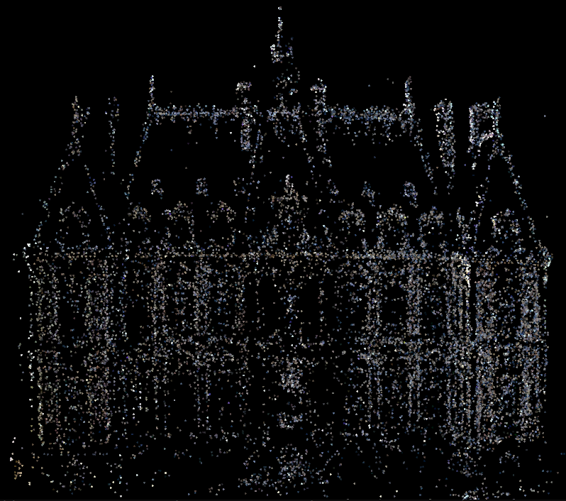
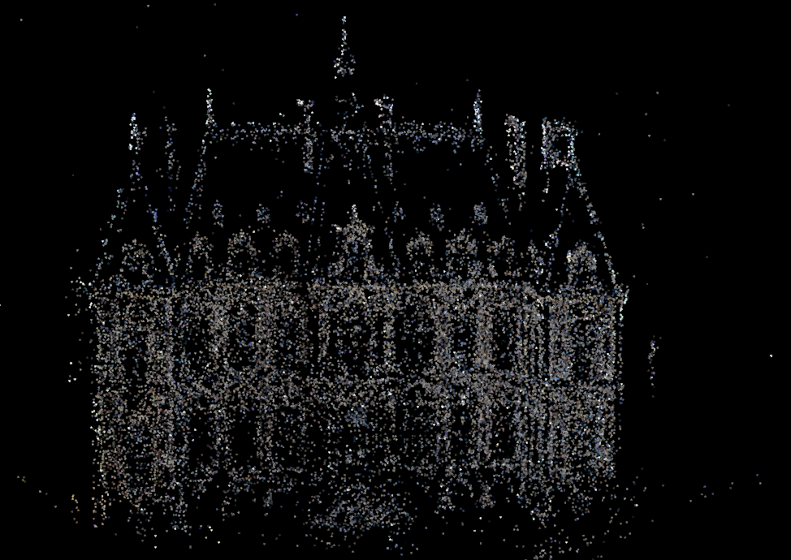
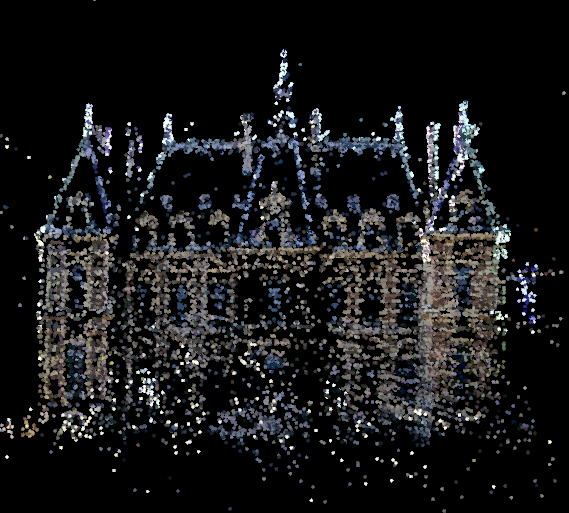

# Handwriting SFM

I prepare to write a simple sfm framework by myself. This framework include **bundle adjustment** and **epipolar line search**.

## Pipeline

- [x] front_end
- [ ] filtering
- [x] bundle adjestment
- [ ] epipolar line search

## Progress

* 20-6-21 finish BA.
  * Before BA
    
  * After BA
    

* 19-10-10

more points 

* 19-10-7

